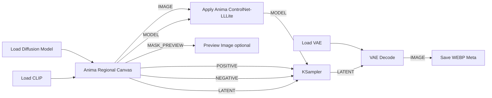

# Anima Regional Canvas

Canvas node for Anima-LLLite Regional ControlNet workflows.

It lets you paint color-coded regions directly inside ComfyUI, outputs the color mask image for `Apply Anima ControlNet-LLLite`, and generates masked conditioning from matching region prompts.

## Requirements

- `kohya-ss/ComfyUI-Anima-LLLite`
- `Sen-sou/Anima-LLLite-Regional-Controlnet` model, for example `anima-lllite-regional-exp-v3.safetensors`

## Design

- `Apply Anima ControlNet-LLLite` stays separate.
- `KSampler`, `VAE Decode`, and `Save WEBP Meta` stay separate.
- External custom nodes are not imported or called.
- This implementation is independently designed, inspired by regional conditioning workflows, and optimized for this canvas-based node. It does not reuse external custom-node code.
- Regional control uses ComfyUI's standard masked conditioning: only painted colors with non-empty prompts are encoded.
- `QUALITY` is for quality/style tags.
- `SCENE` is for count, subject names, background, and situation, for example `2girls, cirno, reimu, cafe`.
- `RED`, `BLUE`, `YELLOW`, `GREEN`, and `MAGENTA` are region prompts.

## Outputs

- `IMAGE`: color mask image for `Apply Anima ControlNet-LLLite image`
- `MODEL`: passthrough model
- `POSITIVE`: masked conditioning for `KSampler positive`
- `NEGATIVE`: conditioning for `KSampler negative`
- `LATENT`: empty latent using the canvas size
- `METADATA`: prompt metadata string
- `MASK_PREVIEW`: preview-only image

## Compatibility

Verified in this workspace:

- Python `3.13.11`
- PyTorch `2.12.1+cu130`
- CUDA build `13.0`
- Pillow `12.2.0`
- NumPy `2.4.4`

Inferred minimum:

- Python: ComfyUI-supported Python, practically `3.10+`.
- PyTorch: ComfyUI-supported PyTorch. This node uses only basic tensor ops and should not require a specific CUDA build.
- CUDA: no direct dependency. CPU or any CUDA build that your ComfyUI/PyTorch already supports is acceptable.
- Pillow/NumPy: no special version pin; ComfyUI's installed versions are sufficient.

The node avoids hard version pins and only lazily uses ComfyUI core helpers when available.

## Standard Connection

```text
Anima Regional Canvas IMAGE -> Apply Anima ControlNet-LLLite image
Apply Anima ControlNet-LLLite MODEL -> KSampler model
Anima Regional Canvas POSITIVE -> KSampler positive
Anima Regional Canvas NEGATIVE -> KSampler negative
Anima Regional Canvas LATENT -> KSampler latent_image
KSampler LATENT -> VAE Decode -> Save WEBP Meta
```

## Connection Chart



## UI Prompt Fields

- `QUALITY`: quality and style tags, for example `masterpiece, absurdres, score_7, anime style`.
- `SCENE`: count, subject names, background, and situation, for example `2girls, cirno, reimu, cafe`.
- `RED` / `BLUE` / `YELLOW` / `GREEN` / `MAGENTA`: prompt for each painted region.
- `NEGATIVE`: negative prompt.

## Colors

- `RED`
- `BLUE`
- `YELLOW`
- `GREEN`
- `MAGENTA`
- white background uses the default `QUALITY` + `SCENE` conditioning
