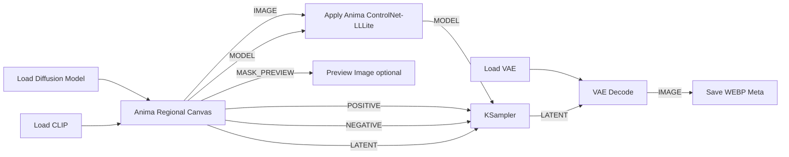
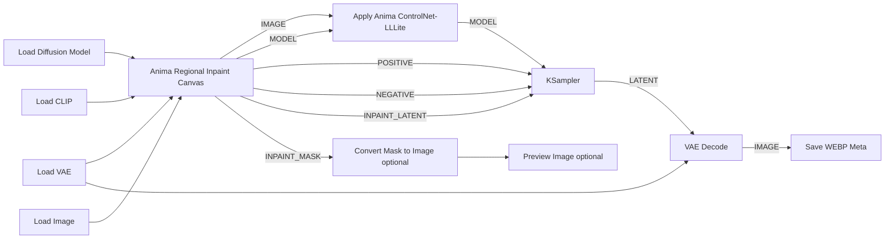

# Anima Regional Canvas


An ANIMA-focused custom node for Anima-LLLite Regional ControlNet workflows.

It is designed for ANIMA workflows using the Anima base model, Anima-LLLite, and the Anima-LLLite Regional ControlNet model. The node lets you paint color-coded regions directly inside ComfyUI, outputs the color mask image for `Apply Anima ControlNet-LLLite`, and generates masked conditioning from matching region prompts.

## Requirements

- Node: [kohya-ss/ComfyUI-Anima-LLLite](https://github.com/kohya-ss/ComfyUI-Anima-LLLite)
- Recommended base model: [circlestone-labs/Anima](https://huggingface.co/circlestone-labs/Anima)
- Model: [anima-lllite-regional-exp-v3.safetensors](https://huggingface.co/Sen-sou/Anima-LLLite-Regional-Controlnet/resolve/main/anima-lllite-regional-exp-v3.safetensors)
- Model repository: [Sen-sou/Anima-LLLite-Regional-Controlnet](https://huggingface.co/Sen-sou/Anima-LLLite-Regional-Controlnet)

## Install

Clone this repository into ComfyUI's `custom_nodes` folder:

```powershell
cd D:\Codex\ComfyUI\custom_nodes
git clone https://github.com/ukr8b3g-cmyk/Anima_Regional_Canvas.git
```

Restart ComfyUI after installation.

This node does not include the Anima-LLLite node or the regional ControlNet model. Install them separately:

- [kohya-ss/ComfyUI-Anima-LLLite](https://github.com/kohya-ss/ComfyUI-Anima-LLLite)
- Recommended base model: [circlestone-labs/Anima](https://huggingface.co/circlestone-labs/Anima)
- [anima-lllite-regional-exp-v3.safetensors](https://huggingface.co/Sen-sou/Anima-LLLite-Regional-Controlnet/resolve/main/anima-lllite-regional-exp-v3.safetensors)

Example workflows are included in `workflows/`:

- `Anima_Regional_Canvas_Test.json`
- `Anima_Regional_Inpaint_Canvas_Test.json`

## Usage

1. Add one of the canvas nodes:
   - `Anima Regional Canvas`: normal regional generation.
   - `Anima Regional Inpaint Canvas`: regional inpaint generation from an optional input image.
2. Check the canvas size shown in the `Canvas width x height` info badge.
   - The size is updated from `Load Canvas` or a connected image.
   - For ANIMA workflows, a larger size is recommended. Smaller sizes work, but they may be too low-resolution for detailed ANIMA output.
3. Enter prompts:
   - `QUALITY`: quality/style tags, for example `masterpiece, absurdres, score_7, anime style`
   - `SCENE`: count, character names, background, and situation, for example `2girls, cirno, reimu, cafe`
   - `RED` / `BLUE` / `YELLOW` / `GREEN` / `MAGENTA`: prompt for each painted region
   - `NEGATIVE`: negative prompt
4. Paint regions on the canvas with the color buttons.
   - `Save Canvas`: save the painted canvas as PNG.
   - `Load Canvas`: load a saved canvas PNG or image back into the canvas.
   - Brush size can be changed with the `Brush` number box or slider.
   - Windows shortcut: `Alt + right-drag` on the canvas. Move left/right to change brush size.
   - Mac shortcut: `Control + Option + left-drag` on the canvas. Move left/right to change brush size.
   - Moving up/down during the shortcut adjusts brush opacity.
   - The brush circle preview shows the current brush size on the canvas.
5. Connect `IMAGE` to `Apply Anima ControlNet-LLLite image`.
6. Connect `POSITIVE`, `NEGATIVE`, and `LATENT` to `KSampler`.
7. For a mask overlay preview, use ComfyUI core `Blend Images`:
   - generated image -> `Blend Images image1`
   - `MASK_PREVIEW` -> `Blend Images image2`
   - `Blend Images` -> `Preview Image`
8. Save the final image with `Save WEBP Meta` if metadata output is needed.

## Node Variants

### Anima Regional Canvas

Use this for normal generation.

- `IMAGE` outputs the painted color mask for `Apply Anima ControlNet-LLLite image`.
- `LATENT` outputs an empty latent using the canvas size.
- Paint red, blue, yellow, green, or magenta regions and enter matching region prompts.

### Anima Regional Inpaint Canvas

Use this for inpaint generation.

- Connect an input image to `image` when you want to inpaint over an existing image.
- Connect `vae` when using the node's `INPAINT_LATENT` output.
- The connected image is shown on the canvas automatically when available.
- Paint only the areas that should be controlled or repainted.
- White/unpainted areas are treated as the keep/base area.
- `grow_mask_by` expands the inpaint mask slightly to reduce hard edges.
- If no `image` and `vae` are connected, the node falls back to an empty latent, similar to the normal node.

## Design

- `Apply Anima ControlNet-LLLite` stays separate.
- `KSampler`, `VAE Decode`, and `Save WEBP Meta` stay separate.
- External custom nodes are not imported or called.
- This implementation is independently designed, inspired by regional conditioning workflows, and optimized for this canvas-based node. It does not reuse external custom-node code.
- Regional control uses ComfyUI's standard masked conditioning: only painted colors with non-empty prompts are encoded.
- `QUALITY` is for quality/style tags.
- `SCENE` is for count, subject names, background, and situation, for example `2girls, cirno, reimu, cafe`.
- `RED`, `BLUE`, `YELLOW`, `GREEN`, and `MAGENTA` are region prompts.

## Outputs

### Anima Regional Canvas

- `IMAGE`: color mask image for `Apply Anima ControlNet-LLLite image`
- `MODEL`: passthrough model
- `POSITIVE`: masked conditioning for `KSampler positive`
- `NEGATIVE`: conditioning for `KSampler negative`
- `LATENT`: empty latent using the canvas size
- `METADATA`: prompt metadata string
- `MASK_PREVIEW`: preview-only image

### Anima Regional Inpaint Canvas

- `IMAGE`: color mask image for `Apply Anima ControlNet-LLLite image`
- `MODEL`: passthrough model
- `POSITIVE`: masked conditioning for `KSampler positive`
- `NEGATIVE`: conditioning for `KSampler negative`
- `INPAINT_LATENT`: inpaint latent when `image` and `vae` are connected; otherwise empty latent
- `INPAINT_MASK`: inpaint mask generated from painted regions
- `METADATA`: prompt metadata string

## Compatibility

Verified in this workspace:

- Python `3.13.11`
- PyTorch `2.12.1+cu130`
- CUDA build `13.0`
- Pillow `12.2.0`
- NumPy `2.4.4`

Inferred minimum:

- Python: ComfyUI-supported Python, practically `3.10+`.
- PyTorch: ComfyUI-supported PyTorch. This node uses only basic tensor ops and should not require a specific CUDA build.
- CUDA: no direct dependency. CPU or any CUDA build that your ComfyUI/PyTorch already supports is acceptable.
- Pillow/NumPy: no special version pin; ComfyUI's installed versions are sufficient.

The node avoids hard version pins and only lazily uses ComfyUI core helpers when available.

## Standard Connection

```text
Anima Regional Canvas IMAGE -> Apply Anima ControlNet-LLLite image
Apply Anima ControlNet-LLLite MODEL -> KSampler model
Anima Regional Canvas POSITIVE -> KSampler positive
Anima Regional Canvas NEGATIVE -> KSampler negative
Anima Regional Canvas LATENT -> KSampler latent_image
KSampler LATENT -> VAE Decode -> Save WEBP Meta
```

## Inpaint Connection

```text
Load Image IMAGE -> Anima Regional Inpaint Canvas image
Load VAE VAE -> Anima Regional Inpaint Canvas vae
Anima Regional Inpaint Canvas IMAGE -> Apply Anima ControlNet-LLLite image
Apply Anima ControlNet-LLLite MODEL -> KSampler model
Anima Regional Inpaint Canvas POSITIVE -> KSampler positive
Anima Regional Inpaint Canvas NEGATIVE -> KSampler negative
Anima Regional Inpaint Canvas INPAINT_LATENT -> KSampler latent_image
KSampler LATENT -> VAE Decode -> Save WEBP Meta
```

## Connection Chart



## Inpaint Connection Chart



## UI Prompt Fields

- `QUALITY`: quality and style tags, for example `masterpiece, absurdres, score_7, anime style`.
- `SCENE`: global composition, count, subject names, pose, background, and situation, for example `1girl, full body, standing with arms out, outdoor, blue sky, green field`.
- `RED` / `BLUE` / `YELLOW` / `GREEN` / `MAGENTA`: prompt for each painted region.
- `NEGATIVE`: negative prompt.

Common prompt rule:

- Put the overall scene in `SCENE`.
- Put region-specific details in the matching color prompt.
- Leave unused color prompts empty.
- White/unpainted areas use the default `QUALITY` + `SCENE` conditioning.

Example:

```text
SCENE:
1girl, full body, standing with arms out, outdoor, blue sky, green field

YELLOW:
long blonde twin tails, large fluffy hair

MAGENTA:
pink one-piece dress

BLUE:
blue eyes

GREEN:
green grass field
```

## Colors

- `RED`
- `BLUE`
- `YELLOW`
- `GREEN`
- `MAGENTA`
- white background uses the default `QUALITY` + `SCENE` conditioning

## Acknowledgements

- [kohya-ss/ComfyUI-Anima-LLLite](https://github.com/kohya-ss/ComfyUI-Anima-LLLite) for the Anima-LLLite ComfyUI node.
- [Sen-sou/Anima-LLLite-Regional-Controlnet](https://huggingface.co/Sen-sou/Anima-LLLite-Regional-Controlnet) for the regional ControlNet model.
- ComfyUI and its community.

## License

MIT License. See [LICENSE](LICENSE).
