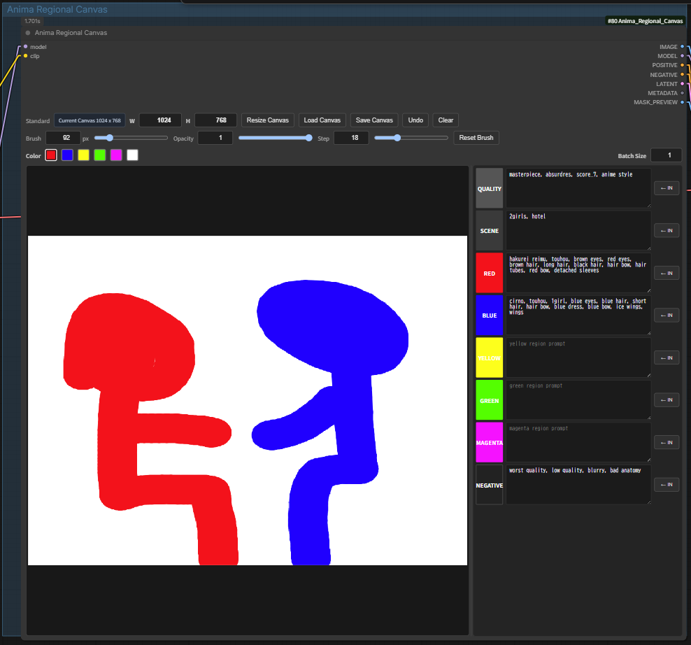
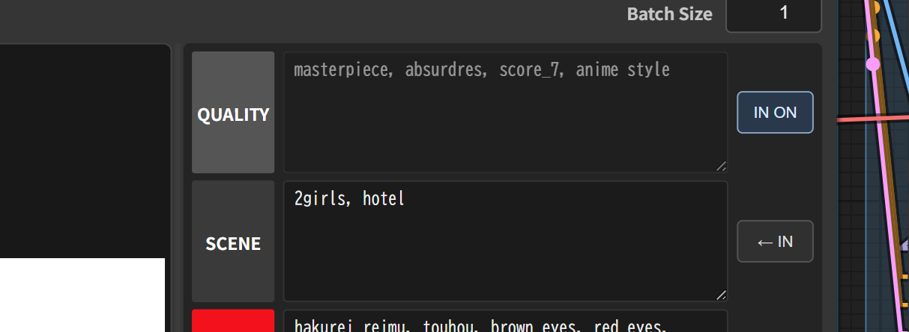
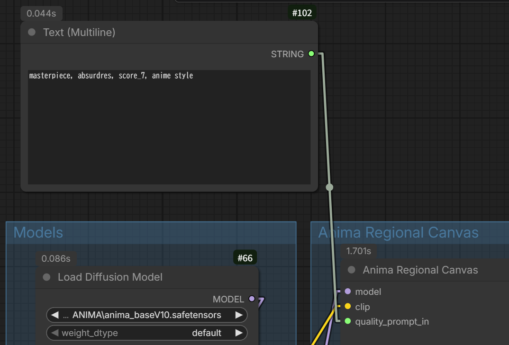
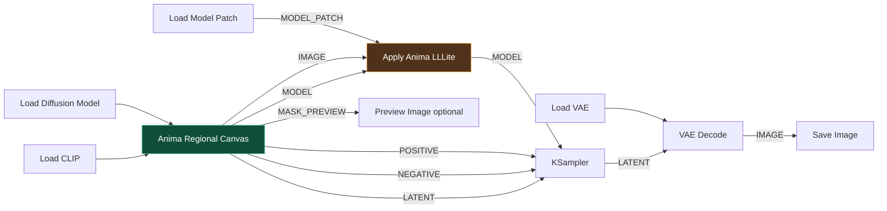
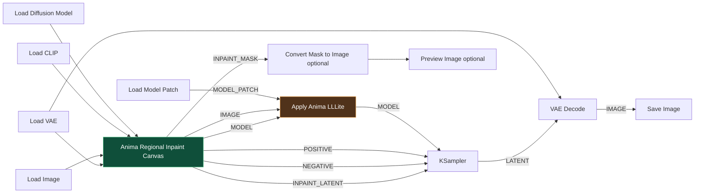

# Anima Regional Canvas
[日本語はこちら](#日本語)


## Update

- Updated both bundled workflows for ComfyUI core `Load Model Patch` and `Apply Anima LLLite`.
- Reorganized the canvas toolbar, enlarged the canvas-size controls, and added a draggable canvas/prompt divider.
- Prompt fields now use local text by default. Click `← IN` only when an external `STRING` input is needed.
- Fixed canvas persistence so painted regions are restored safely after tab changes or canvas rebuilds.


An ANIMA-focused custom node for Anima-LLLite regional-control workflows.

It is designed for ANIMA workflows using the Anima base model and the Anima-LLLite Regional ControlNet model. The node lets you paint color-coded regions directly inside ComfyUI, outputs the color mask image for ComfyUI core `Apply Anima LLLite`, and generates masked conditioning from matching region prompts.

## Requirements

- A current ComfyUI build containing core `Load Model Patch` and `Apply Anima LLLite`
- Anima base model: [circlestone-labs/Anima](https://huggingface.co/circlestone-labs/Anima) Other Anima fork models
- Model: [anima-lllite-regional-exp-v3.safetensors](https://huggingface.co/Sen-sou/Anima-LLLite-Regional-Controlnet/resolve/main/anima-lllite-regional-exp-v3.safetensors)
- Model repository: [Sen-sou/Anima-LLLite-Regional-Controlnet](https://huggingface.co/Sen-sou/Anima-LLLite-Regional-Controlnet)

Place the regional model where ComfyUI's `Load Model Patch` can find it (normally `ComfyUI/models/model_patches`). This repository does not include model files.

## Install

Search for "anima regional" from ComfyUI Manager.


Clone this repository into ComfyUI's `custom_nodes` folder:

```powershell
cd ComfyUI\custom_nodes
git clone https://github.com/ukr8b3g-cmyk/Anima_Regional_Canvas.git
```

Restart ComfyUI after installation.


Example workflows are included in `workflows/`:

- [Anima_Regional_Canvas_Test.json](workflows/Anima_Regional_Canvas_Test.json)
- [Anima_Regional_Inpaint_Canvas_Test.json](workflows/Anima_Regional_Inpaint_Canvas_Test.json)

## Usage

1. Add one of the canvas nodes:
   - `Anima Regional Canvas`: normal regional generation.
   - `Anima Regional Inpaint Canvas`: regional inpaint generation from an optional input image.
2. Check the canvas size shown in the `Canvas width x height` info badge.
   - The default size is `1024 x 1024`.
   - Enter a width and height in the number boxes, then press `Enter` or move focus away to apply the resize.
   - `Load Canvas` and a connected image update the canvas size. Sizes are normalized down to multiples of 8 to match the latent output.
   - For ANIMA workflows, a larger size is recommended. Smaller sizes work, but they may be too low-resolution for detailed ANIMA output.
   - Drag the divider between the canvas and prompt panel to change their widths. The canvas has a protected minimum width.



3. Enter prompts:
   - `QUALITY`: quality/style tags, for example `masterpiece, absurdres, score_7, anime style`
   - `SCENE`: count, character names, background, and situation, for example `2girls, cirno, reimu, cafe`
   - `RED` / `BLUE` / `YELLOW` / `GREEN` / `MAGENTA`: prompt for each painted region
   - `NEGATIVE`: negative prompt
   - Local text entry is enabled by default.
   - Click `← IN` beside a field to add its external `STRING` socket. The button changes to `IN ON` and disables the local text box.
   - Connect `Text (Multiline)` or another `STRING` output to the newly added socket. Disconnect the cable, then click `IN ON` to return to local text.





4. Paint regions on the canvas with the color buttons.
   - `Save Canvas`: save the painted canvas as PNG.
   - `Load Canvas`: load a saved canvas PNG or image back into the canvas.
   - Brush size can be changed with the `Brush` number box or slider.
   - Windows shortcut: `Alt + right-drag` on the canvas. Move left/right to change brush size.
   - Mac shortcut: `Control + Option + left-drag` on the canvas. Move left/right to change brush size.
   - Moving up/down during the shortcut adjusts brush opacity.
   - The brush circle preview shows the current brush size on the canvas.
5. Load `anima-lllite-regional-exp-v3.safetensors` with `Load Model Patch`, then connect it to `Apply Anima LLLite model_patch`.
6. Connect the canvas `IMAGE` output to `Apply Anima LLLite image`.
7. Connect `POSITIVE`, `NEGATIVE`, and `LATENT` to `KSampler`.
8. For a mask overlay preview, use ComfyUI core `Blend Images`:
   - generated image -> `Blend Images image1`
   - `MASK_PREVIEW` -> `Blend Images image2`
   - `Blend Images` -> `Preview Image`
9. Save the final image with `Save WEBP Meta` if metadata output is needed.

## Node Variants

### Anima Regional Canvas

Use this for normal generation.

- `IMAGE` outputs the painted color mask for `Apply Anima LLLite image`.
- `LATENT` outputs an empty latent using the canvas size.
- Paint red, blue, yellow, green, or magenta regions and enter matching region prompts.

### Anima Regional Inpaint Canvas

Use this for inpaint generation.

- Connect an input image to `image` when you want to inpaint over an existing image.
- Connect `vae` when using the node's `INPAINT_LATENT` output.
- The connected image is shown on the canvas automatically when available.
- Paint only the areas that should be controlled or repainted.
- White/unpainted areas are treated as the keep/base area.
- `grow_mask_by` expands the inpaint mask slightly to reduce hard edges.
- If no `image` and `vae` are connected, the node falls back to an empty latent, similar to the normal node.

## Design

- ComfyUI core `Load Model Patch` and `Apply Anima LLLite` stay separate.
- `KSampler`, `VAE Decode`, and `Save WEBP Meta` stay separate.
- External custom nodes are not imported or called.
- This implementation is independently designed, inspired by regional conditioning workflows, and optimized for this canvas-based node. It does not reuse external custom-node code.
- Regional control uses ComfyUI's standard masked conditioning: only painted colors with non-empty prompts are encoded.
- `QUALITY` is for quality/style tags.
- `SCENE` is for count, subject names, background, and situation, for example `2girls, cirno, reimu, cafe`.
- `RED`, `BLUE`, `YELLOW`, `GREEN`, and `MAGENTA` are region prompts.

## Outputs

### Anima Regional Canvas

- `IMAGE`: color mask image for `Apply Anima LLLite image`
- `MODEL`: passthrough model
- `POSITIVE`: masked conditioning for `KSampler positive`
- `NEGATIVE`: conditioning for `KSampler negative`
- `LATENT`: empty latent using the canvas size
- `METADATA`: prompt metadata string
- `MASK_PREVIEW`: preview-only image

### Anima Regional Inpaint Canvas

- `IMAGE`: color mask image for `Apply Anima LLLite image`
- `MODEL`: passthrough model
- `POSITIVE`: masked conditioning for `KSampler positive`
- `NEGATIVE`: conditioning for `KSampler negative`
- `INPAINT_LATENT`: inpaint latent when `image` and `vae` are connected; otherwise empty latent
- `INPAINT_MASK`: inpaint mask generated from painted regions
- `METADATA`: prompt metadata string

## Compatibility

Verified in this workspace:

- Python `3.13.11`
- PyTorch `2.12.1+cu130`
- CUDA build `13.0`
- Pillow `12.2.0`
- NumPy `2.4.4`

Inferred minimum:

- Python: ComfyUI-supported Python, practically `3.10+`.
- PyTorch: ComfyUI-supported PyTorch. This node uses only basic tensor ops and should not require a specific CUDA build.
- CUDA: no direct dependency. CPU or any CUDA build that your ComfyUI/PyTorch already supports is acceptable.
- Pillow/NumPy: no special version pin; ComfyUI's installed versions are sufficient.

The node avoids hard version pins and only lazily uses ComfyUI core helpers when available.

The bundled workflows require a ComfyUI build that includes `ModelPatchLoader` and the model-patch input on `AnimaLLLiteApply`.

## Standard Connection

```text
Load Model Patch MODEL_PATCH -> Apply Anima LLLite model_patch
Anima Regional Canvas IMAGE -> Apply Anima LLLite image
Anima Regional Canvas MODEL -> Apply Anima LLLite model
Apply Anima LLLite MODEL -> KSampler model
Anima Regional Canvas POSITIVE -> KSampler positive
Anima Regional Canvas NEGATIVE -> KSampler negative
Anima Regional Canvas LATENT -> KSampler latent_image
KSampler LATENT -> VAE Decode -> Save Image
```

## Inpaint Connection

```text
Load Image IMAGE -> Anima Regional Inpaint Canvas image
Load VAE VAE -> Anima Regional Inpaint Canvas vae
Load Model Patch MODEL_PATCH -> Apply Anima LLLite model_patch
Anima Regional Inpaint Canvas IMAGE -> Apply Anima LLLite image
Anima Regional Inpaint Canvas MODEL -> Apply Anima LLLite model
Apply Anima LLLite MODEL -> KSampler model
Anima Regional Inpaint Canvas POSITIVE -> KSampler positive
Anima Regional Inpaint Canvas NEGATIVE -> KSampler negative
Anima Regional Inpaint Canvas INPAINT_LATENT -> KSampler latent_image
KSampler LATENT -> VAE Decode -> Save Image
```

## Standard Connection Chart


```mermaid
flowchart LR
  Model["Load Diffusion Model"] --> Canvas["Anima Regional Canvas"]
  Clip["Load CLIP"] --> Canvas
  VAE["Load VAE"] --> Decode["VAE Decode"]
  Patch["Load Model Patch"] -- MODEL_PATCH --> LLLite["Apply Anima LLLite"]
  Canvas -- IMAGE --> LLLite
  Canvas -- MODEL --> LLLite
  LLLite -- MODEL --> KSampler
  Canvas -- POSITIVE --> KSampler
  Canvas -- NEGATIVE --> KSampler
  Canvas -- LATENT --> KSampler
  KSampler -- LATENT --> Decode
  Decode -- IMAGE --> Save["Save Image"]
  Canvas -- MASK_PREVIEW --> Preview["Preview Image optional"]
  classDef canvasNode fill:#0f4f3a,stroke:#69d89b,color:#ffffff
  classDef llliteNode fill:#50321a,stroke:#ffb45c,color:#ffffff
  class Canvas canvasNode
  class LLLite llliteNode
```

## Inpaint Connection Chart


```mermaid
flowchart LR
  Model["Load Diffusion Model"] --> Canvas["Anima Regional Inpaint Canvas"]
  Clip["Load CLIP"] --> Canvas
  Image["Load Image"] --> Canvas
  VAE["Load VAE"] --> Canvas
  VAE --> Decode["VAE Decode"]
  Patch["Load Model Patch"] -- MODEL_PATCH --> LLLite["Apply Anima LLLite"]
  Canvas -- IMAGE --> LLLite
  Canvas -- MODEL --> LLLite
  LLLite -- MODEL --> KSampler
  Canvas -- POSITIVE --> KSampler
  Canvas -- NEGATIVE --> KSampler
  Canvas -- INPAINT_LATENT --> KSampler
  KSampler -- LATENT --> Decode
  Decode -- IMAGE --> Save["Save Image"]
  Canvas -- INPAINT_MASK --> MaskToImage["Convert Mask to Image optional"]
  MaskToImage --> MaskPreview["Preview Image optional"]
  classDef canvasNode fill:#0f4f3a,stroke:#69d89b,color:#ffffff
  classDef llliteNode fill:#50321a,stroke:#ffb45c,color:#ffffff
  class Canvas canvasNode
  class LLLite llliteNode
```

## UI Prompt Fields

- `QUALITY`: quality and style tags, for example `masterpiece, absurdres, score_7, anime style`.
- `SCENE`: global composition, count, subject names, pose, background, and situation, for example `1girl, full body, standing with arms out, outdoor, blue sky, green field`.
- `RED` / `BLUE` / `YELLOW` / `GREEN` / `MAGENTA`: prompt for each painted region.
- `NEGATIVE`: negative prompt.

Common prompt rule:

- Put the overall scene in `SCENE`.
- Put region-specific details in the matching color prompt.
- Leave unused color prompts empty.
- White/unpainted areas use the default `QUALITY` + `SCENE` conditioning.

Example:

```text
SCENE:
1girl, full body, standing with arms out, outdoor, blue sky, green field

YELLOW:
long blonde twin tails, large fluffy hair

MAGENTA:
pink one-piece dress

BLUE:
blue eyes

GREEN:
green grass field
```

## Colors

- `RED`
- `BLUE`
- `YELLOW`
- `GREEN`
- `MAGENTA`
- white background uses the default `QUALITY` + `SCENE` conditioning

## Acknowledgements

- [kohya-ss/ComfyUI-Anima-LLLite](https://github.com/kohya-ss/ComfyUI-Anima-LLLite) for the original Anima-LLLite ComfyUI implementation that preceded the core nodes.
- [Sen-sou/Anima-LLLite-Regional-Controlnet](https://huggingface.co/Sen-sou/Anima-LLLite-Regional-Controlnet) for the regional ControlNet model.
- This project was inspired by Sen-sou's Anima-LLLite-Regional-Controlnet, but the code in this repository is original, independently developed, and not copied or plagiarized.
- ComfyUI and its community.

## License

MIT License. See [LICENSE](LICENSE).

---

# 日本語

[English](#anima-regional-canvas)

ANIMA向けの色分けリージョナルキャンバスノードです。ComfyUI上で領域を色分けして描画し、各色に対応するプロンプトのマスク付きConditioningと、`Apply Anima LLLite`用のカラー画像を出力します。

## 更新内容

- 同梱の通常生成・Inpaintワークフローを、ComfyUIコアの`Load Model Patch`と`Apply Anima LLLite`へ更新しました。
- ツールバーを3段に整理し、キャンバスサイズ入力を拡大しました。
- キャンバスとプロンプト欄の境界をドラッグして、左右の幅を変更できます。
- プロンプトはローカル入力が初期状態です。外部テキストが必要な項目だけ`← IN`で入力ソケットを追加できます。

## 必要環境

- `Load Model Patch`と`Apply Anima LLLite`を含む現在のComfyUI
- Animaベースモデル、または対応する派生モデル
- [anima-lllite-regional-exp-v3.safetensors](https://huggingface.co/Sen-sou/Anima-LLLite-Regional-Controlnet/resolve/main/anima-lllite-regional-exp-v3.safetensors)

リージョナルモデルは通常、`ComfyUI/models/model_patches`へ配置します。本リポジトリにモデルファイルは含まれません。

## インストール

ComfyUI Managerで`anima regional`を検索するか、ComfyUIの`custom_nodes`へクローンしてください。

```powershell
cd ComfyUI\custom_nodes
git clone https://github.com/ukr8b3g-cmyk/Anima_Regional_Canvas.git
```

インストール後はComfyUIを再起動します。サンプルは`workflows/`にあります。

- [Anima_Regional_Canvas_Test.json](workflows/Anima_Regional_Canvas_Test.json)：通常生成
- [Anima_Regional_Inpaint_Canvas_Test.json](workflows/Anima_Regional_Inpaint_Canvas_Test.json)：Inpaint

## 基本的な使い方

1. `Anima Regional Canvas`または`Anima Regional Inpaint Canvas`を追加します。
2. W/Hへキャンバスサイズを入力し、`Resize Canvas`を押します。
3. `QUALITY`、`SCENE`、各色、`NEGATIVE`へプロンプトを入力します。
4. 色ボタンを選択してキャンバスへ領域を描きます。
5. `Load Model Patch`でリージョナルモデルを読み込み、`Apply Anima LLLite`の`model_patch`へ接続します。
6. Canvasの`MODEL`と`IMAGE`を`Apply Anima LLLite`へ接続します。
7. Canvasの`POSITIVE`、`NEGATIVE`、`LATENT`をKSamplerへ接続します。Inpaintでは`INPAINT_LATENT`を使用します。

## プロンプト入力

- `QUALITY`：品質・スタイルタグ
- `SCENE`：人数、キャラクター名、背景、状況など全体の指定
- `RED` / `BLUE` / `YELLOW` / `GREEN` / `MAGENTA`：各色の領域に対応する指定
- `NEGATIVE`：ネガティブプロンプト

通常はノード内のテキスト欄へ直接入力します。外部の`Text (Multiline)`を使う場合だけ、対象行の`← IN`を押してください。ボタンが`IN ON`になり、対応する`*_prompt_in`ソケットがノード左側へ追加されます。

ローカル入力へ戻す場合は、先にSTRINGケーブルを外してから`IN ON`を押します。どのプロンプトを外部入力にするかは項目ごとに選択できます。

## キャンバス操作

- `Resize Canvas`：W/Hの値でキャンバスを変更
- `Load Canvas` / `Save Canvas`：キャンバス画像の読込・保存
- `Undo` / `Clear`：直前の操作を戻す／描画を消去
- `Brush` / `Opacity` / `Step`：ブラシサイズ、不透明度、間隔
- 中央の境界をドラッグ：キャンバスとプロンプト欄の幅を変更
- Windows：`Alt + 右ドラッグ`でブラシサイズ、上下移動で不透明度を調整
- macOS：`Control + Option + 左ドラッグ`

## Inpaint

`Anima Regional Inpaint Canvas`の`image`へ入力画像、`vae`へVAEを接続します。描き直したい領域を色で塗り、`INPAINT_LATENT`をKSamplerへ接続してください。未塗装の白い領域は基本的に保持領域として扱われます。

## ライセンス

MIT License。詳細は[LICENSE](LICENSE)を参照してください。
